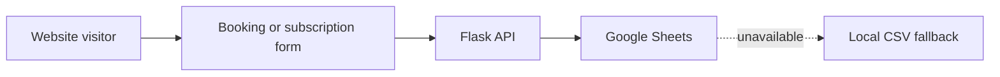

# Yasodha PG Website

A property website with gallery content, booking enquiries and email subscriptions.
Flask serves the site and writes submissions to Google Sheets, with a local CSV fallback.

## Data flow



The site includes property photos, gallery interactions, responsive styling and service-worker
assets. Repository content does not independently verify property availability or amenities.

## Local setup

```bash
git clone https://github.com/DanushArun/Yasodha-pg-website.git
cd Yasodha-pg-website
python3 -m venv .venv
source .venv/bin/activate
python -m pip install -r requirements.txt
python server.py
```

The default server port is 5001. Configure `HOST`, `PORT` and `FLASK_ENV` for your environment.
Use your own `SPREADSHEET_ID` and `SHEET_NAME`. Supply an authorized service-account configuration
locally, or the base64-encoded JSON through `GOOGLE_CREDENTIALS` as supported by the server.
Do not reuse credential artifacts in a checkout. Startup can initialize worksheet headers;
use a dedicated test sheet when evaluating the application.

## API and storage

| Endpoint | Purpose |
| --- | --- |
| `GET /api/gallery-images` | List property gallery images |
| `POST /submit_booking` | Accept a booking enquiry |
| `POST /subscribe_email` | Accept an email subscription |
| `/test` | Inspect configured storage/fallback state |

The implemented booking route is `/submit_booking`, not the older README's `/submit-inquiry`.
When Sheets initialization or writes fail, the server can use `inquiries.csv`.
That fallback needs durable storage if deployed; an ephemeral hosting filesystem is not a database.

## Deployment and verification

See [DEPLOYMENT.md](DEPLOYMENT.md) and
[render-google-sheets-setup.md](render-google-sheets-setup.md) for the recorded hosting setup.
[render.yaml](render.yaml) contains deployment configuration.

Source, routes and dependency paths were inspected. No real enquiry, Google Sheets write or
live deployment check was performed for this update. There is no automated test suite.
Confirm form delivery, fallback storage and credential handling with synthetic enquiries before
release.
