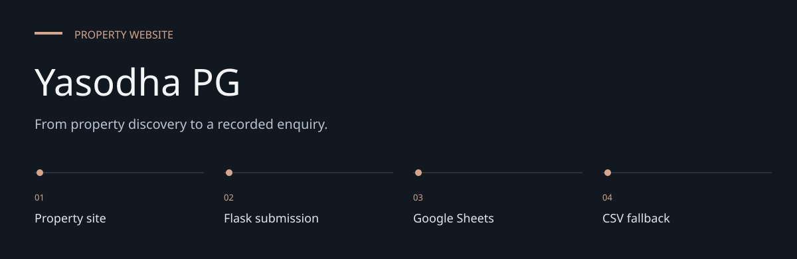
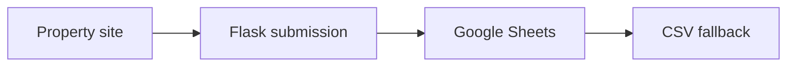
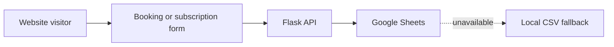

# Yasodha PG

**From property discovery to a recorded enquiry.**

A property website with gallery content, booking enquiries and email subscriptions.
Flask serves the site and writes submissions to Google Sheets, with a local CSV fallback.


[Architecture](docs/ARCHITECTURE.md) · [Evaluation guide](docs/EVALUATION.md)

**Contents:** [The challenge](#the-challenge) · [Walkthrough](#walk-through-the-project) ·
[Implementation](#implementation-state) · [Design choices](#engineering-choices) ·
[Next evidence](#next-evidence-to-collect)

---

## The challenge

Property discovery needs photos and clear contact information, but an enquiry is only useful if it
reaches storage. This website couples a property presentation with Flask submission routes, Google
Sheets persistence and a local fallback path.

## System at a glance



## Walk through the project

### 1. Explore the property

Open the site and gallery. Images and amenities are supplied content; verify them with the
property operator.

### 2. Submit synthetic enquiries

Use the booking or email-subscription controls in an authorized test environment. Avoid real
prospective-tenant data during evaluation.

### 3. Verify the storage destination

Check whether a submission reached the configured sheet or the CSV fallback. Startup can create or
initialize worksheet headers.

### 4. Check deployment persistence

Inspect the hosting configuration and fallback file durability. A success response without a
durable record is not evidence of reliable enquiry delivery.

## Data flow



The site includes property photos, gallery interactions, responsive styling and service-worker
assets. Repository content does not independently verify property availability or amenities.

## Local setup

```bash
git clone https://github.com/DanushArun/Yasodha-pg-website.git
cd Yasodha-pg-website
python3 -m venv .venv
source .venv/bin/activate
python -m pip install -r requirements.txt
python server.py
```

The default server port is 5001. Configure `HOST`, `PORT` and `FLASK_ENV` for your environment.
Use your own `SPREADSHEET_ID` and `SHEET_NAME`. Supply an authorized service-account configuration
locally, or the base64-encoded JSON through `GOOGLE_CREDENTIALS` as supported by the server.
Do not reuse credential artifacts in a checkout. Startup can initialize worksheet headers;
use a dedicated test sheet when evaluating the application.

## API and storage

| Endpoint | Purpose |
| --- | --- |
| `GET /api/gallery-images` | List property gallery images |
| `POST /submit_booking` | Accept a booking enquiry |
| `POST /subscribe_email` | Accept an email subscription |
| `/test` | Inspect configured storage/fallback state |

The implemented booking route is `/submit_booking`, not the older README's `/submit-inquiry`.
When Sheets initialization or writes fail, the server can use `inquiries.csv`.
That fallback needs durable storage if deployed; an ephemeral hosting filesystem is not a database.

## Deployment and verification

See [DEPLOYMENT.md](DEPLOYMENT.md) and
[render-google-sheets-setup.md](render-google-sheets-setup.md) for the recorded hosting setup.
[render.yaml](render.yaml) contains deployment configuration.

Source, routes and dependency paths were inspected. No real enquiry, Google Sheets write or
live deployment check was performed for this update. There is no automated test suite.
Confirm form delivery, fallback storage and credential handling with synthetic enquiries before
release.

## Engineering choices

**Server routes define the contract.** The booking path is /submit_booking, not the old
documentation route.

**Fallback is visible.** A CSV fallback is a distinct operational mode with its own durability
requirements.

**Startup has side effects.** Use a dedicated test sheet because initialization can alter headers.

## Implementation state

| State | Current evidence |
| --- | --- |
| Present | Property site and gallery assets |
| Present | Booking/subscription routes and storage fallback |
| Configuration required | Authorized Google sheet and service account |
| Not verified | Live hosting, delivered enquiries and durable fallback |

The [architecture guide](docs/ARCHITECTURE.md) maps these statements to source entry points.
The [evaluation guide](docs/EVALUATION.md) separates inspection, executable checks and
domain validation, with the next evidence needed for each project.

## Next evidence to collect

- Test sheet and fallback paths with synthetic enquiries.
- Review durable storage and credential handling.
- Capture published-site delivery and gallery acceptance evidence.
