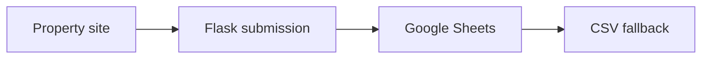

# Yasodha PG — Architecture and implementation

This guide follows the tracked implementation. Proposed work is identified separately.

## The problem and the system boundary

Property discovery needs photos and clear contact information, but an enquiry is only useful if it
reaches storage. This website couples a property presentation with Flask submission routes, Google
Sheets persistence and a local fallback path.

## Processing path

## End-to-end behavior

### 1. Explore the property

Open the site and gallery. Images and amenities are supplied content; verify them with the
property operator.

### 2. Submit synthetic enquiries

Use the booking or email-subscription controls in an authorized test environment. Avoid real
prospective-tenant data during evaluation.

### 3. Verify the storage destination

Check whether a submission reached the configured sheet or the CSV fallback. Startup can create or
initialize worksheet headers.

### 4. Check deployment persistence

Inspect the hosting configuration and fallback file durability. A success response without a
durable record is not evidence of reliable enquiry delivery.

## Design choices and consequences

### Server routes define the contract

The booking path is /submit_booking, not the old documentation route.

### Fallback is visible

A CSV fallback is a distinct operational mode with its own durability requirements.

### Startup has side effects

Use a dedicated test sheet because initialization can alter headers.

## Source entry points

### [index.html](../index.html)

This file is part of the reviewed path described above. Follow its imports and calls
for the exact interface rather than inferring behavior from the filename.

### [server.py](../server.py)

- `add_cors_headers` — Implementation entry; inspect source for its exact behavior.
- `after_request` — Implementation entry; inspect source for its exact behavior.
- `initialize_google_sheet` — Checks if the sheet is empty and adds headers if it is.
- `initialize_csv_file` — Creates CSV file with headers if it doesn't exist.
- `write_to_csv` — Writes data to CSV file.
- `index` — Serves the index.html file.

### [js/form-handler.js](../js/form-handler.js)

This file is part of the reviewed path described above. Follow its imports and calls
for the exact interface rather than inferring behavior from the filename.

### [render.yaml](../render.yaml)

This file is part of the reviewed path described above. Follow its imports and calls
for the exact interface rather than inferring behavior from the filename.

### [DEPLOYMENT.md](../DEPLOYMENT.md)

This file is part of the reviewed path described above. Follow its imports and calls
for the exact interface rather than inferring behavior from the filename.

## Implementation state

| State | Evidence boundary |
| --- | --- |
| Present | Property site and gallery assets |
| Present | Booking/subscription routes and storage fallback |
| Configuration required | Authorized Google sheet and service account |
| Not verified | Live hosting, delivered enquiries and durable fallback |

“Present” means tracked source or assets exist. It does not mean a production or domain
validation has passed. See [Evaluation](EVALUATION.md) for reproducible checks and limits.
